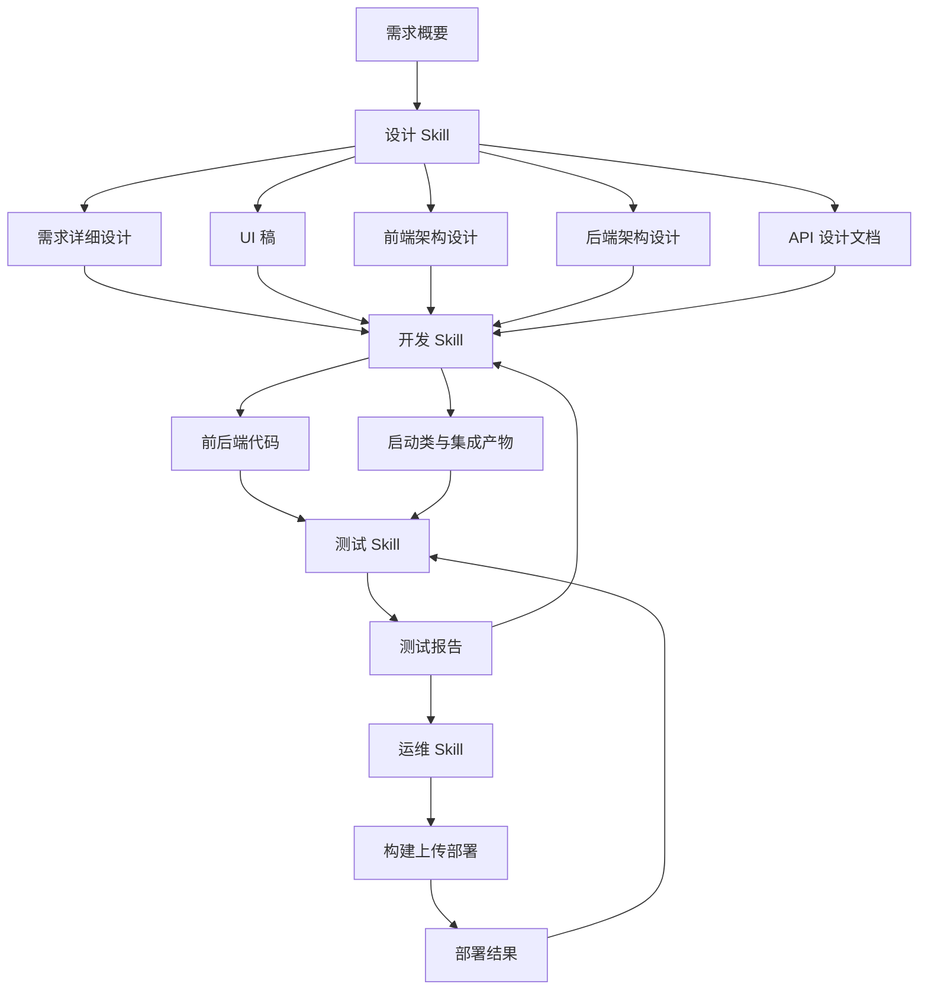

# CDS 四个 Skill 协同原理说明

## 文档目标

本文说明 `cds-product-design-zh`、`cds-product-develop-zh`、`cds-product-test-zh`、`cds-product-devops-zh` 这四个 skill 如何围绕**页面功能**协同工作，帮助用户从需求设计一路推进到代码开发、测试验收和部署上线。

它们的协作不是简单的“一个结束后再启动下一个”，而是通过以下三层机制形成闭环：

- **阶段分工**：设计、开发、测试、运维各自负责不同职责
- **产物流转**：上一个阶段的交付物，作为下一个阶段的输入
- **状态驱动**：通过 session / task 文件恢复上下文、判断当前步骤并继续执行
- **跨 skill 协作**：在关键节点通过外部 skill 调用形成质量闭环

## 四个 Skill 的角色定位

### 1. `cds-product-design-zh`：负责把需求变成可开发产物

该 skill 的核心任务不是直接写代码，而是把页面需求转成后续开发可消费的设计资产，包括：

- 页面需求详细设计
- 页面数据结构设计
- 页面业务流程设计
- UI 稿 `.pen`
- 前端架构设计文档
- 后端架构设计文档
- API 设计文档

设计 skill 的本质作用，是为开发 skill 提供**最低必要输入**与**结构化约束**，避免后续代码生成完全靠自由发挥。

### 2. `cds-product-develop-zh`：负责把设计产物落实为代码

该 skill 的核心任务是根据设计阶段交付物，分别完成：

- 前端代码生成
- 后端代码生成
- 启动类代码生成
- 代码审查
- 模块集成验证

开发 skill 并不是“从零猜测业务”，而是严格依赖设计产物推进。尤其在后端实现时，会优先检查：

- `{功能名称}-需求详细设计.md`
- `{功能名称}-后端架构设计.md`
- `{功能名称}-API设计文档.md`

若输入不完整，则必须先与用户确认是否允许合理发挥。

### 3. `cds-product-test-zh`：负责独立验收与问题闭环

测试 skill 既服务于设计阶段，也服务于开发阶段。

它承担两类职责：

- **设计阶段检查**：检查需求、原型、方案是否完整、是否可实施
- **开发阶段测试**：执行编译、启动、功能、集成、验收测试

测试 skill 的意义，在于把设计和开发从“自我确认”变成“独立验收”，从而形成质量闭环。

### 4. `cds-product-devops-zh`：负责把可交付代码转为可运行版本

运维 skill 的核心任务是把已经通过测试的项目继续推进到部署链路中，包括：

- 项目编译构建
- 代码打包压缩
- CDS 接口上传
- 远程构建触发
- 远程安装启动
- 部署结果验证
- 企微通知发送

因此，运维 skill 本质上承接的是“可交付产物”，而不是“设计文档”本身。

## 协同的底层原理

### 原理一：按阶段拆分职责，而不是让一个 Skill 包打天下

这套 skill 的核心思想，是把页面从需求到上线拆成四个独立阶段：

1. **设计阶段**：把页面需求结构化
2. **开发阶段**：把结构化设计实现成代码
3. **测试阶段**：把代码和设计进行独立验证
4. **运维阶段**：把验证通过的代码交付到环境中

这样拆分有三个好处：

- 让每个 skill 的能力边界清晰
- 降低上下文污染，避免一个 skill 同时处理太多问题
- 让每个阶段都能留下明确交付物，便于回溯和复用

### 原理二：通过“产物交接”驱动阶段切换

四个 skill 的协作，不是靠口头说明，而是靠文档与代码产物传递。

### 关键产物流转链路

| 阶段 | 主要产物 | 下游使用方 | 作用 |
|------|----------|------------|------|
| 设计 | 需求详细设计 | 开发、测试 | 作为页面实现与测试依据 |
| 设计 | UI 稿 `.pen` / UI 规范 | 开发、测试 | 作为前端页面还原依据 |
| 设计 | 前端架构设计 | 开发 | 指导前端目录、组件、路由和接口接入 |
| 设计 | 后端架构设计 | 开发 | 指导后端模块结构、实体、服务实现 |
| 设计 | API 设计文档 | 开发、测试 | 作为接口生成与接口验证依据 |
| 开发 | 前后端代码、启动类 | 测试、运维 | 作为编译、启动、部署输入 |
| 测试 | 测试报告、验收报告 | 开发、运维 | 作为修复或上线依据 |
| 运维 | 构建包、上传记录、部署结果 | 用户、测试 | 作为上线结果与回溯依据 |

因此，这四个 skill 的本质关系是：

- **设计负责定义页面应该是什么**
- **开发负责实现页面应该怎么做**
- **测试负责验证做出来的是否符合设计和质量要求**
- **运维负责让通过验证的结果进入真实环境**

### 原理三：通过 Session / Task 文件维持长流程状态

每个 skill 都不是一次性执行完全部工作，而是通过进度文件维持当前状态。

### 各 Skill 的状态文件

| Skill | 主要 session 文件 | 主要 task 文件 | 作用 |
|------|-------------------|----------------|------|
| 设计 | `dsg-session.md` | `dsg-task.md` | 记录设计阶段和页面设计任务状态 |
| 开发 | `dev-session.md` | `dev-task.md` | 记录模块开发进度和当前开发阶段 |
| 测试 | `test-session.md` | `test-task.md` | 记录测试执行状态和问题跟踪 |
| 运维 | `devops-session.md` | `devops-task.md` | 记录部署流程状态和部署结果 |

这些文件的作用不是“做笔记”，而是：

- 在下一次进入 skill 时恢复上下文
- 判断当前应该继续哪个步骤
- 识别前置产物是否已经齐全
- 让跨阶段协作能够有明确状态依据

### 原理四：通过“前置检查 + 用户确认”控制自由发挥边界

这套 skill 不是完全开放式生成，而是通过前置检查机制限制自由发挥。

### 典型控制点

#### 设计阶段
- 没有需求概要文档时，不应直接进入详细设计
- 涉及后端命名、建表、模块结构时，要先确认 `moduleCode` 与 `acronym`

#### 开发阶段
- 没有需求详细设计时，默认不应直接生成后端代码
- 如果缺少后端架构设计或 API 设计文档，要先询问用户是否允许合理发挥
- 从文档或 metadata 中提取到 `moduleCode` / `acronym` 后，仍然要向用户确认

#### 测试与运维阶段
- 没有开发产物时，不应直接执行编译、部署或验收
- 没有关键环境配置时，不应直接进行启动、上传或部署

这意味着四个 skill 的协作原则不是“能跑就先跑”，而是“先校验输入，再执行动作”。

### 原理五：通过外部 Skill 调用形成质量闭环

每个 skill 不只做自己的工作，还会在特定节点调用其他 skill 完成闭环。

### 典型调用关系

| 当前 Skill | 场景 | 调用目标 | 目的 |
|-----------|------|----------|------|
| 设计 | 设计检查验收 | `cds-product-test-zh` | 对设计产物做独立检查 |
| 开发 | 代码编译测试 | `cds-product-test-zh` | 对生成代码做编译、启动、集成验证 |
| 开发 | 部署验证 | `cds-product-devops-zh` | 将开发结果继续推进到部署链路 |
| 测试 | 发现开发问题 | `cds-product-develop-zh` | 回流问题，推动修复 |
| 测试 | 测试通过后部署 | `cds-product-devops-zh` | 推进上线 |
| 运维 | 部署失败回滚 | `cds-product-develop-zh` | 回退代码或回退构建版本 |

因此，这套体系不是单向流水线，而是**带回流能力的闭环系统**。

## 页面功能从设计到上线的协作流程

## 面向“页面流程设计与开发”的理解方式

如果从“页面流程”角度理解这四个 skill，可以这样看：

### 设计 skill 负责定义页面流程

它回答的是：

- 这个页面解决什么业务问题
- 页面有哪些功能区块
- 页面涉及哪些字段和实体
- 用户在页面上的操作顺序是什么
- 前端需要哪些组件和交互
- 后端需要哪些接口和数据模型

### 开发 skill 负责实现页面流程

它回答的是：

- 页面组件如何落地
- 接口如何接入
- 后端实体、DAO、Service、Controller 如何实现
- 启动类、配置、模块结构如何补齐

### 测试 skill 负责验证页面流程

它回答的是：

- 页面流程是否符合设计预期
- 前后端联动是否正常
- 编译、启动、集成是否通过
- 是否存在功能缺失、异常路径、性能问题

### 运维 skill 负责发布页面流程

它回答的是：

- 当前版本是否可以构建和打包
- 构建产物是否能上传并远程安装
- 页面所在模块是否成功上线
- 上线结果是否被记录并通知到相关人员

## 推荐使用顺序

### 场景一：从零开始设计并开发一个页面

1. 使用 `cds-product-design-zh` 输出完整设计产物
2. 使用 `cds-product-test-zh` 做设计检查或方案验收
3. 使用 `cds-product-develop-zh` 基于设计产物生成代码
4. 再次使用 `cds-product-test-zh` 做编译、启动、功能与集成测试
5. 使用 `cds-product-devops-zh` 执行构建、上传、部署与通知

### 场景二：页面已设计完成，只补开发和上线

1. 从现有设计产物中读取需求详细设计、UI 稿、前后端架构设计
2. 直接进入 `cds-product-develop-zh`
3. 开发完成后进入 `cds-product-test-zh`
4. 测试通过后进入 `cds-product-devops-zh`

### 场景三：测试发现问题后的回流

1. `cds-product-test-zh` 输出问题报告
2. `cds-product-develop-zh` 根据问题修复代码
3. `cds-product-test-zh` 回归验证
4. `cds-product-devops-zh` 重新部署

## 总结

这四个 skill 的协同原理，可以概括为一句话：

**设计 skill 产出约束，开发 skill 落地实现，测试 skill 独立验收，运维 skill 负责交付，而 session 状态、交付物文件和跨 skill 调用共同保证整个页面流程能够持续推进且可回溯。**

## 相关文档

- `CDS-SKILLS-GUIDE.md`
- `cds-product-design-zh/SKILL.md`
- `cds-product-develop-zh/SKILL.md`
- `cds-product-test-zh/SKILL.md`
- `cds-product-devops-zh/SKILL.md`
