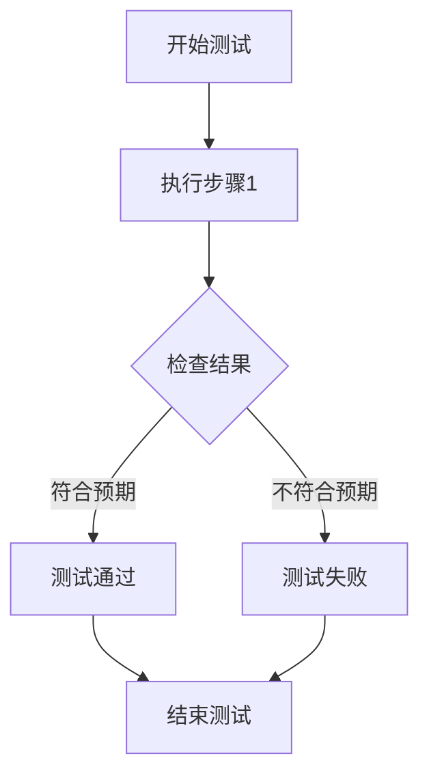
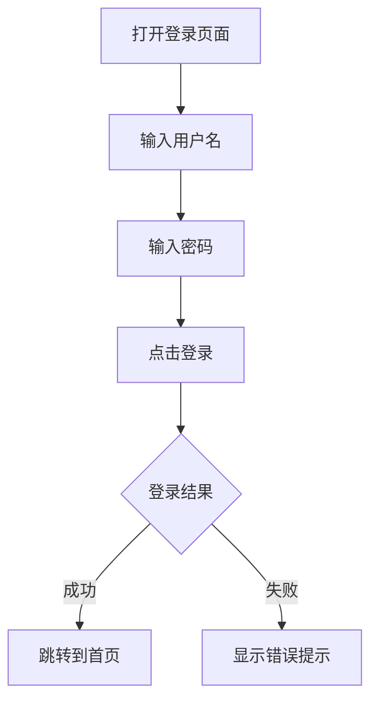

# 测试用例编写指南

## 核心目标
确保开发的功能符合PRD要求，系统无bug。

## 测试用例结构
```markdown
# 测试用例：[功能模块]-[测试场景]
- **测试ID**：TC-[模块]-[序号]
- **测试目的**：验证[具体功能]是否符合PRD要求
- **前置条件**：[测试前需要满足的条件]
- **测试步骤**：
  1. [步骤1]
  2. [步骤2]
- **预期结果**：[期望的输出结果]
- **实际结果**：[测试执行的实际结果]
- **测试状态**：通过/失败/阻塞/跳过
```

## 测试用例分类
1. **功能测试用例**：验证功能是否按PRD要求正常工作
2. **边界测试用例**：测试输入的边界条件
3. **异常测试用例**：测试异常情况下的系统表现

## Obsidian输出格式

### 1. 文本格式测试用例
```markdown
## 测试用例集：[功能模块]

### TC-001：[测试场景]
- **测试目的**：[验证内容]
- **前置条件**：[条件描述]
- **测试步骤**：
  1. [操作步骤]
  2. [操作步骤]
- **预期结果**：[期望结果]
```

### 2. Canvas图展示
使用Obsidian Canvas功能创建测试用例流程图：
- 创建Canvas文件
- 添加测试步骤节点
- 连接步骤展示测试流程
- 添加预期结果标注

### 3. Obsidian绘图方法
使用Obsidian内置的Mermaid图表：


## 测试执行流程
1. **读取PRD**：分析PRD中的功能需求和验收标准
2. **编写测试用例**：基于PRD编写测试用例文档
3. **执行测试**：按照测试用例执行测试
4. **记录结果**：记录测试执行结果和发现的问题
5. **生成报告**：输出测试执行报告

## 测试重点
- **核心功能**：优先测试PRD中的核心功能
- **业务流程**：验证完整的业务流程是否正常
- **数据验证**：确保数据处理符合PRD要求
- **界面交互**：验证用户界面交互是否符合设计要求

## 测试用例示例

### 文本格式示例
```markdown
## 用户登录功能测试用例

### TC-001：正常登录
- **测试目的**：验证用户使用正确的用户名和密码能够正常登录
- **前置条件**：用户已注册，系统运行正常
- **测试步骤**：
  1. 打开登录页面
  2. 输入正确的用户名：test@example.com
  3. 输入正确的密码：password123
  4. 点击登录按钮
- **预期结果**：成功登录并跳转到首页

### TC-002：错误密码登录
- **测试目的**：验证用户使用错误密码登录时的错误处理
- **前置条件**：用户已注册，系统运行正常
- **测试步骤**：
  1. 打开登录页面
  2. 输入正确的用户名：test@example.com
  3. 输入错误的密码：wrongpassword
  4. 点击登录按钮
- **预期结果**：显示错误提示"用户名或密码错误"
```

### Canvas图示例
创建Canvas文件`测试用例-用户登录.canvas`：
- 添加节点："开始测试" → "输入用户名" → "输入密码" → "点击登录" → "检查结果"
- 连接节点展示测试流程
- 添加预期结果标注

### Mermaid图表示例
```markdown
## 用户登录测试流程


## 测试报告输出
```markdown
# 测试执行报告

## 测试概述
- **测试范围**：[功能模块名称]
- **测试时间**：[开始时间] - [结束时间]

## 测试结果
- **测试用例总数**：[总数]
- **通过用例数**：[通过数]
- **失败用例数**：[失败数]
- **测试通过率**：[通过率]%

## 发现的问题
1. [问题描述] - [严重程度]
2. [问题描述] - [严重程度]

## 测试结论
[对测试结果的总结和建议]
```