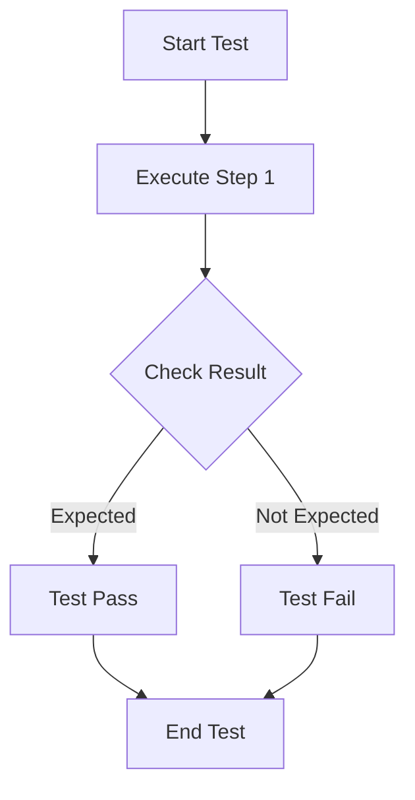
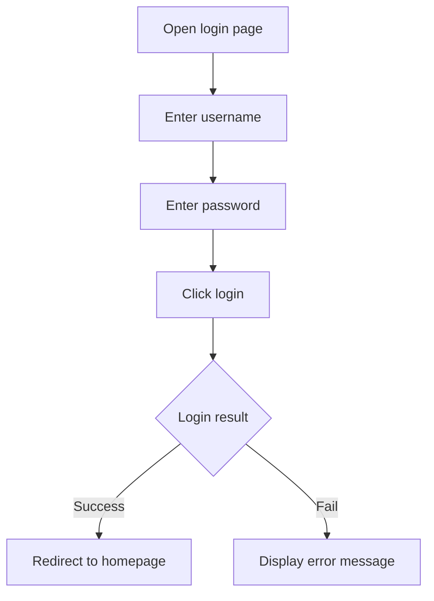

# Test Case Writing Guide

## Core Objective
Ensure that developed features meet PRD requirements and the system is bug-free.

## Test Case Structure
```markdown
# Test Case: [Feature Module]-[Test Scenario]
- **Test ID**: TC-[Module]-[Number]
- **Test Purpose**: Verify whether [specific feature] meets PRD requirements
- **Prerequisites**: [Conditions that need to be met before testing]
- **Test Steps**:
  1. [Step 1]
  2. [Step 2]
- **Expected Result**: [Expected output result]
- **Actual Result**: [Actual result of test execution]
- **Test Status**: Pass/Fail/Blocked/Skipped
```

## Test Case Classification
1. **Functional Test Cases**: Verify whether functions work normally according to PRD requirements
2. **Boundary Test Cases**: Test boundary conditions of inputs
3. **Exception Test Cases**: Test system performance under abnormal conditions

## Obsidian Output Format

### 1. Text Format Test Cases
```markdown
## Test Case Set: [Feature Module]

### TC-001: [Test Scenario]
- **Test Purpose**: [Verification content]
- **Prerequisites**: [Condition description]
- **Test Steps**:
  1. [Operation step]
  2. [Operation step]
- **Expected Result**: [Expected result]
```

### 2. Canvas Diagram Display
Use Obsidian Canvas functionality to create test case flow diagrams:
- Create Canvas file
- Add test step nodes
- Connect steps to display test flow
- Add expected result annotations

### 3. Obsidian Drawing Method
Use Obsidian's built-in Mermaid diagrams:


## Test Execution Process
1. **Read PRD**: Analyze functional requirements and acceptance criteria in PRD
2. **Write Test Cases**: Write test case documents based on PRD
3. **Execute Tests**: Execute tests according to test cases
4. **Record Results**: Record test execution results and discovered issues
5. **Generate Report**: Output test execution report

## Testing Focus
- **Core Features**: Prioritize testing core features in PRD
- **Business Processes**: Verify whether complete business processes work normally
- **Data Validation**: Ensure data processing meets PRD requirements
- **UI Interaction**: Verify whether user interface interaction meets design requirements

## Test Case Examples

### Text Format Example
```markdown
## User Login Function Test Cases

### TC-001: Normal Login
- **Test Purpose**: Verify that users can log in normally with correct username and password
- **Prerequisites**: User has registered, system is running normally
- **Test Steps**:
  1. Open login page
  2. Enter correct username: test@example.com
  3. Enter correct password: password123
  4. Click login button
- **Expected Result**: Successfully logged in and redirected to homepage

### TC-002: Wrong Password Login
- **Test Purpose**: Verify error handling when user logs in with wrong password
- **Prerequisites**: User has registered, system is running normally
- **Test Steps**:
  1. Open login page
  2. Enter correct username: test@example.com
  3. Enter wrong password: wrongpassword
  4. Click login button
- **Expected Result**: Display error message "Username or password error"
```

### Canvas Diagram Example
Create Canvas file `测试用例-用户登录.canvas`:
- Add nodes: "Start Test" → "Enter Username" → "Enter Password" → "Click Login" → "Check Result"
- Connect nodes to display test flow
- Add expected result annotations

### Mermaid Diagram Example
```markdown
## User Login Test Flow


## Test Report Output
```markdown
# Test Execution Report

## Test Overview
- **Test Scope**: [Feature module name]
- **Test Time**: [Start time] - [End time]

## Test Results
- **Total Test Cases**: [Total number]
- **Passed Cases**: [Number passed]
- **Failed Cases**: [Number failed]
- **Test Pass Rate**: [Pass rate]%

## Issues Found
1. [Issue description] - [Severity]
2. [Issue description] - [Severity]

## Test Conclusion
[Summary and suggestions for test results]
```