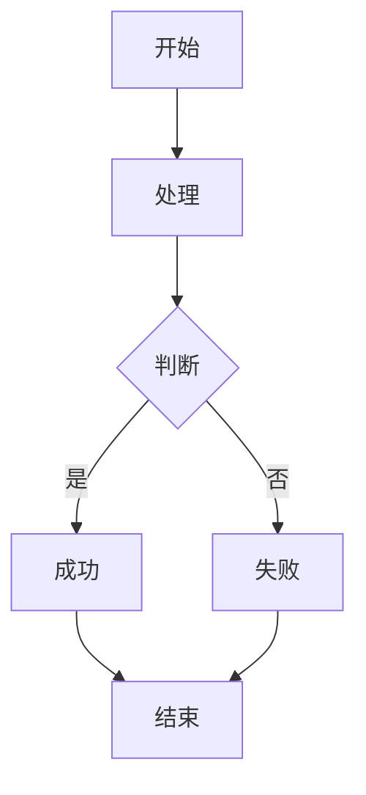
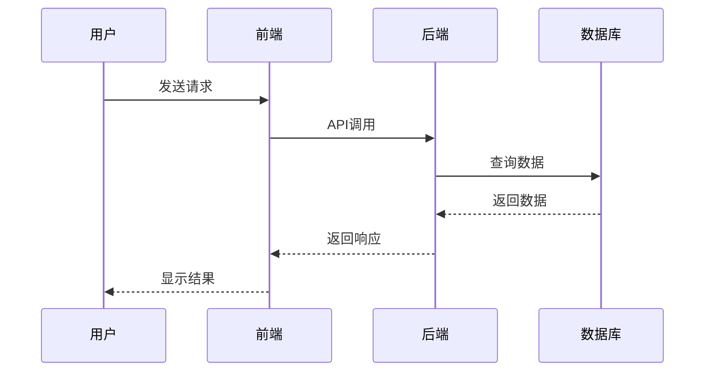
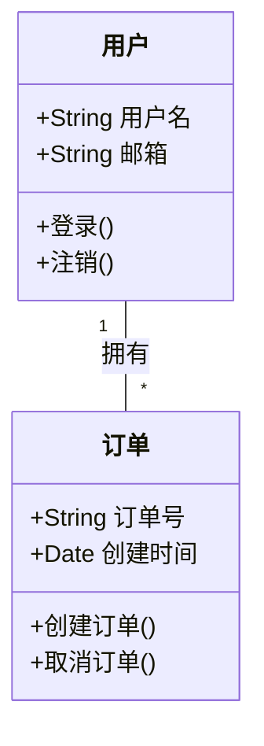
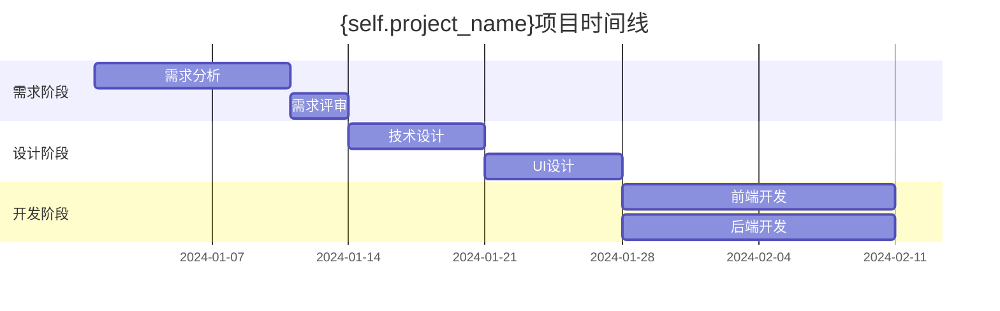

# Obsidian输出模板

## 通用Frontmatter模板

```yaml
---
title: "{项目名称}{文档类型}"
aliases: ["{项目名称}{文档类型简写}"]
tags: ["{文档类型标签}", "项目文档", "{项目名称}"]
created: "{{date:YYYY-MM-DD}}"
modified: "{{date:YYYY-MM-DD}}"
project: "{项目名称}"
document-type: "{文档类型}"
status: "active"
version: "1.0"
author: "{作者}"
priority: "{优先级}"
---
```

## 文档类型映射表

| 自定义skill | 文档类型 | 文档类型标签 | 相关文档 |
|------------|---------|-------------|---------|
| sz-requirements-analysis-design | 需求文档 | 需求分析 | 技术架构设计文档、UI原型设计文档 |
| sz-architecture-design | 技术架构设计文档 | 架构设计 | 需求文档、数据库设计文档、API接口文档 |
| sz-database-api-design | 数据库设计文档 | 数据库设计 | 技术架构设计文档、API接口文档 |
| sz-database-api-design | API接口文档 | API设计 | 技术架构设计文档、数据库设计文档 |
| sz-ui-prototype-design | UI原型设计文档 | UI设计 | 需求文档、前端技术架构设计文档 |
| sz-frontend-implementation | 前端开发文档 | 前端开发 | UI原型设计文档、API接口文档 |
| sz-backend-implementation | 后端开发文档 | 后端开发 | 数据库设计文档、API接口文档 |
| sz-integration-deployment | 部署文档 | 部署运维 | 前端开发文档、后端开发文档 |
| sz-deliverables-review | 评审报告 | 质量评审 | 所有相关文档 |

## Callouts使用指南

### 重要信息
```markdown
> [!important]
> 这是非常重要的信息，需要特别注意。
```

### 注意事项
```markdown
> [!note]
> 这是需要注意的事项。
```

### 警告信息
```markdown
> [!warning]
> 这里有潜在的风险或问题。
```

### 提示信息
```markdown
> [!tip]
> 这里有一些有用的提示。
```

### 成功信息
```markdown
> [!success]
> 操作成功完成。
```

## Wikilinks链接规范

### 链接到其他文档
```markdown
[[{项目名称}需求文档]]
[[{项目名称}技术架构设计文档]]
[[{项目名称}数据库设计文档]]
```

### 链接到具体章节
```markdown
[[{项目名称}需求文档#功能模块]]
[[{项目名称}技术架构设计文档#前端架构]]
[[{项目名称}数据库设计文档#表结构设计]]
```

### 链接到块
```markdown
[[{项目名称}需求文档#^核心需求]]
[[{项目名称}技术架构设计文档#^架构决策]]
```

## Mermaid图表模板

### 流程图


### 序列图


### 类图


## 任务列表模板

```markdown
## 任务跟踪

### 待办事项
- [ ] 需求评审
- [ ] 技术方案设计
- [ ] UI原型设计
- [ ] 数据库设计

### 进行中
- [x] 项目启动
- [-] 需求分析
- [ ] 架构设计

### 已完成
- [x] 项目立项
- [x] 团队组建
```

## 属性定义模板

```yaml
# 在frontmatter中定义属性
properties:
  - name: "status"
    displayName: "状态"
    type: "select"
    options: ["待办", "进行中", "已完成", "已取消"]
  
  - name: "priority"
    displayName: "优先级"
    type: "select"
    options: ["高", "中", "低"]
  
  - name: "estimate"
    displayName: "预估工时"
    type: "number"
    unit: "小时"
  
  - name: "assignee"
    displayName: "负责人"
    type: "text"
```

## Bases视图配置模板

```yaml
# {项目名称}-文档管理.base
---
filters:
  tag: "{项目名称}"

properties:
  document-type:
    displayName: "文档类型"
  status:
    displayName: "状态"
  priority:
    displayName: "优先级"
  created:
    displayName: "创建时间"
  modified:
    displayName: "修改时间"

views:
  - type: table
    name: "文档总览"
    order:
      - file.name
      - document-type
      - status
      - priority
      - created
  
  - type: cards
    name: "按状态分组"
    groupBy: status
    order:
      - file.name
      - document-type
  
  - type: list
    name: "待办事项"
    filters:
      and:
        - tag: "{项目名称}"
        - property: status = "待办"
    order:
      - priority
      - file.name
```

## 自动化脚本模板

```python
# auto_obsidian.py
import os
import re
from datetime import datetime
import yaml

class ObsidianConverter:
    def __init__(self, project_name, base_dir="."):
        self.project_name = project_name
        self.base_dir = base_dir
        self.doc_types = {
            "需求文档": ["需求分析", "需求文档"],
            "技术设计文档": ["架构设计", "技术文档"],
            "数据库设计文档": ["数据库设计", "技术文档"],
            "API接口文档": ["API设计", "技术文档"],
            "UI原型设计文档": ["UI设计", "设计文档"],
            "前端开发文档": ["前端开发", "开发文档"],
            "后端开发文档": ["后端开发", "开发文档"],
            "部署文档": ["部署运维", "运维文档"],
            "评审报告": ["质量评审", "评审文档"]
        }
    
    def convert_document(self, input_path, doc_type):
        """转换单个文档为Obsidian格式"""
        
        if not os.path.exists(input_path):
            print(f"文件不存在: {input_path}")
            return None
        
        # 读取原始内容
        with open(input_path, 'r', encoding='utf-8') as f:
            content = f.read()
        
        # 提取标题
        title_match = re.search(r'^#\s+(.+)$', content, re.MULTILINE)
        title = title_match.group(1) if title_match else f"{self.project_name}{doc_type}"
        
        # 创建frontmatter
        frontmatter = self._create_frontmatter(title, doc_type)
        
        # 构建Obsidian内容
        obsidian_content = self._add_frontmatter(frontmatter)
        obsidian_content += self._process_content(content, doc_type)
        obsidian_content += self._add_related_links(doc_type)
        
        # 确定输出路径
        output_dir = self._get_output_dir(doc_type)
        os.makedirs(output_dir, exist_ok=True)
        output_path = os.path.join(output_dir, f"{self.project_name}{doc_type}.md")
        
        # 保存文件
        with open(output_path, 'w', encoding='utf-8') as f:
            f.write(obsidian_content)
        
        print(f"已转换: {output_path}")
        return output_path
    
    def _create_frontmatter(self, title, doc_type):
        """创建frontmatter"""
        tags = self.doc_types.get(doc_type, [doc_type, "项目文档"])
        
        return {
            'title': title,
            'aliases': [f"{self.project_name}{doc_type.replace('文档', '')}"],
            'tags': tags + [self.project_name],
            'created': datetime.now().strftime("%Y-%m-%d"),
            'modified': datetime.now().strftime("%Y-%m-%d"),
            'project': self.project_name,
            'document-type': doc_type,
            'status': "active",
            'version': "1.0"
        }
    
    def _add_frontmatter(self, frontmatter):
        """添加frontmatter到文档"""
        return f"---\n{yaml.dump(frontmatter, allow_unicode=True)}---\n\n"
    
    def _process_content(self, content, doc_type):
        """处理文档内容"""
        # 移除可能的原有frontmatter
        content = re.sub(r'^---\n.*?\n---\n', '', content, flags=re.DOTALL)
        
        # 根据文档类型添加特定的callouts
        if doc_type == "需求文档":
            content = self._add_requirement_callouts(content)
        elif doc_type == "评审报告":
            content = self._add_review_callouts(content)
        
        return content
    
    def _add_requirement_callouts(self, content):
        """为需求文档添加callouts"""
        # 查找重要需求并添加callouts
        patterns = [
            (r'(核心需求[:：])', 'important'),
            (r'(必须实现[:：])', 'important'),
            (r'(可选功能[:：])', 'note'),
            (r'(风险提示[:：])', 'warning')
        ]
        
        for pattern, callout_type in patterns:
            content = re.sub(
                pattern,
                f'> [!{callout_type}]\n> \\1',
                content
            )
        
        return content
    
    def _add_review_callouts(self, content):
        """为评审报告添加callouts"""
        patterns = [
            (r'(严重问题[:：])', 'warning'),
            (r'(建议改进[:：])', 'tip'),
            (r'(通过评审[:：])', 'success'),
            (r'(需要修改[:：])', 'important')
        ]
        
        for pattern, callout_type in patterns:
            content = re.sub(
                pattern,
                f'> [!{callout_type}]\n> \\1',
                content
            )
        
        return content
    
    def _add_related_links(self, doc_type):
        """添加相关文档链接"""
        related_links = {
            "需求文档": ["技术架构设计文档", "UI原型设计文档"],
            "技术架构设计文档": ["需求文档", "数据库设计文档", "API接口文档"],
            "数据库设计文档": ["技术架构设计文档", "API接口文档"],
            "API接口文档": ["技术架构设计文档", "数据库设计文档"],
            "UI原型设计文档": ["需求文档", "前端技术架构设计文档"],
            "前端开发文档": ["UI原型设计文档", "API接口文档"],
            "后端开发文档": ["数据库设计文档", "API接口文档"],
            "部署文档": ["前端开发文档", "后端开发文档"],
            "评审报告": ["所有相关文档"]
        }
        
        links = related_links.get(doc_type, [])
        if not links:
            return ""
        
        link_text = "\n## 相关文档\n\n"
        for link in links:
            if link == "所有相关文档":
                # 添加所有相关文档的链接
                for doc_type_name in self.doc_types.keys():
                    link_text += f"- [[{self.project_name}{doc_type_name}]]\n"
            else:
                link_text += f"- [[{self.project_name}{link}]]\n"
        
        return link_text
    
    def _get_output_dir(self, doc_type):
        """获取输出目录"""
        dir_mapping = {
            "需求文档": "01-需求文档",
            "技术架构设计文档": "02-技术设计",
            "数据库设计文档": "02-技术设计",
            "API接口文档": "02-技术设计",
            "UI原型设计文档": "03-设计文档",
            "前端开发文档": "04-开发文档",
            "后端开发文档": "04-开发文档",
            "部署文档": "05-部署运维",
            "评审报告": "06-评审记录"
        }
        
        subdir = dir_mapping.get(doc_type, "00-其他文档")
        return os.path.join(self.base_dir, f"{self.project_name}-知识库", subdir)
    
    def create_knowledge_base(self):
        """创建完整的知识库结构"""
        kb_dir = os.path.join(self.base_dir, f"{self.project_name}-知识库")
        
        # 创建目录结构
        directories = [
            "00-项目概览",
            "01-需求文档",
            "02-技术设计",
            "03-设计文档",
            "04-开发文档",
            "05-部署运维",
            "06-评审记录",
            "07-会议记录",
            "08-参考资料",
            "attachments"
        ]
        
        for directory in directories:
            os.makedirs(os.path.join(kb_dir, directory), exist_ok=True)
        
        # 创建项目概述文档
        overview_content = f"""---
title: "{self.project_name}项目概述"
aliases: ["{self.project_name}概述"]
tags: ["项目概述", "项目文档", "{self.project_name}"]
created: "{datetime.now().strftime('%Y-%m-%d')}"
modified: "{datetime.now().strftime('%Y-%m-%d')}"
project: "{self.project_name}"
document-type: "项目概述"
status: "active"
---

# {self.project_name}项目概述

> [!abstract] 项目简介
> 这是{self.project_name}项目的概述文档。

## 项目目标
- 目标1
- 目标2
- 目标3

## 项目范围
- 范围说明

## 项目成员
- 项目经理
- 开发人员
- 测试人员

## 项目时间线

"""
        
        overview_path = os.path.join(kb_dir, "00-项目概览", f"{self.project_name}项目概述.md")
        with open(overview_path, 'w', encoding='utf-8') as f:
            f.write(overview_content)
        
        # 创建Bases视图
        self.create_bases_view(kb_dir)
        
        print(f"知识库已创建: {kb_dir}")
        return kb_dir
    
    def create_bases_view(self, kb_dir):
        """创建Bases视图"""
        bases_content = f"""---
filters:
  tag: "{self.project_name}"

properties:
  document-type:
    displayName: "文档类型"
  status:
    displayName: "状态"
  created:
    displayName: "创建时间"
  modified:
    displayName: "修改时间"

views:
  - type: table
    name: "项目文档总览"
    order:
      - file.name
      - document-type
      - status
      - created
      - modified
  
  - type: cards
    name: "按文档类型查看"
    groupBy: document-type
    order:
      - file.name
      - status
  
  - type: list
    name: "最近修改"
    sort:
      - modified desc
    limit: 10
    order:
      - file.name
      - modified
"""
        
        bases_path = os.path.join(kb_dir, f"{self.project_name}-文档管理.base")
        with open(bases_path, 'w', encoding='utf-8') as f:
            f.write(bases_content)
        
        print(f"Bases视图已创建: {bases_path}")

# 使用示例
if __name__ == "__main__":
    # 创建转换器
    converter = ObsidianConverter("微平台", ".")
    
    # 转换单个文档
    # converter.convert_document("01需求文档/微平台需求概要文档.md", "需求文档")
    
    # 创建完整知识库
    converter.create_knowledge_base()
    
    print("Obsidian转换完成！")
```

## 使用说明

### 1. 单个文档转换
```bash
python auto_obsidian.py --project 微平台 --input 01需求文档/微平台需求概要文档.md --type 需求文档
```

### 2. 批量转换
```bash
python auto_obsidian.py --project 微平台 --batch
```

### 3. 创建知识库
```bash
python auto_obsidian.py --project 微平台 --create-kb
```

### 4. 集成到自定义skill
在自定义skill的工作流程中添加：
```python
# 生成原始文档后，调用Obsidian转换
if use_obsidian_format:
    converter = ObsidianConverter(project_name)
    obsidian_path = converter.convert_document(original_path, doc_type)
    print(f"Obsidian格式文档已生成: {obsidian_path}")
```