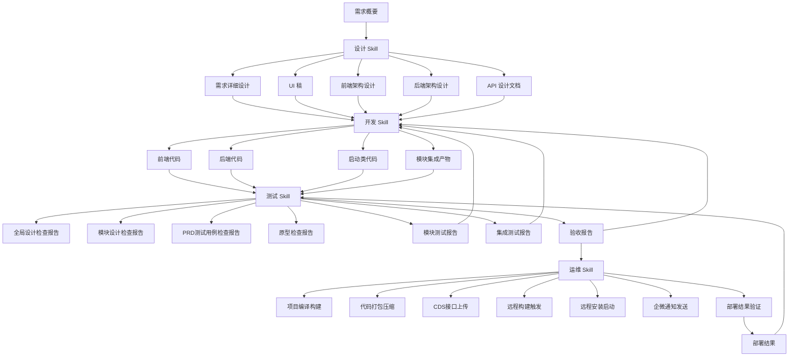

## 页面功能从设计到上线的协作流程

```mermaid
graph TD
    A[需求概要] --> B[设计 Skill]
    B --> C[需求详细设计]
    B --> D[UI 稿]
    B --> E[前端架构设计]
    B --> F[后端架构设计]
    B --> G[API 设计文档]
    C --> H[开发 Skill]
    D --> H
    E --> H
    F --> H
    G --> H
    H --> I[前端代码]
    H --> J[后端代码]
    H --> K[启动类代码]
    H --> L[模块集成产物]
    I --> M[测试 Skill]
    J --> M
    K --> M
    L --> M
    M --> N[全局设计检查报告]
    M --> O[模块设计检查报告]
    M --> P[PRD测试用例检查报告]
    M --> Q[原型检查报告]
    M --> R[模块测试报告]
    M --> S[集成测试报告]
    M --> T[验收报告]
    T --> U[运维 Skill]
    U --> V[项目编译构建]
    U --> W[代码打包压缩]
    U --> X[CDS接口上传]
    U --> Y[远程构建触发]
    U --> Z[远程安装启动]
    U --> AA[企微通知发送]
    U --> BB[部署结果验证]
    BB --> CC[部署结果]
    R --> H
    S --> H
    T --> H
    CC --> M
```
